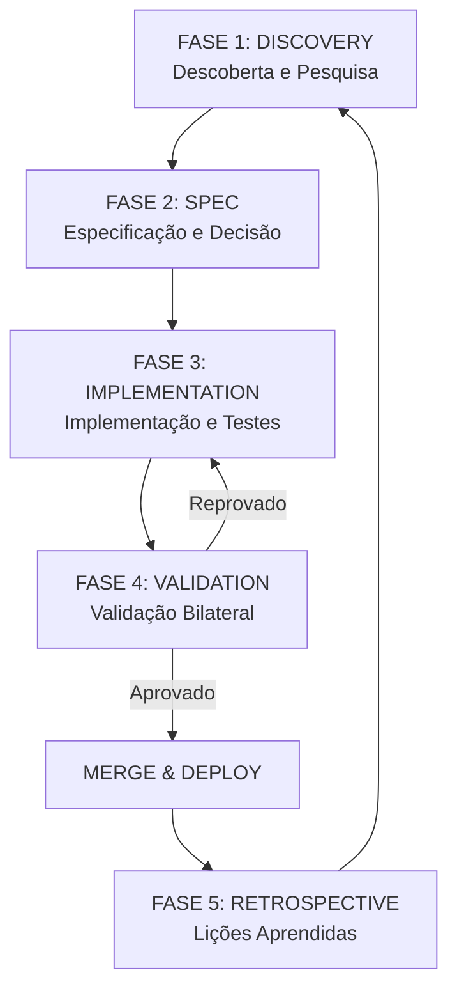

# Rabelus Quant Protocol (RQP) v1.0
## Metodologia de Desenvolvimento Ágil Quantitativo

**Versão:** 1.0.0  
**Data:** 2026-02-04  
**Status:** ✅ Publicado  
**Autor:** Rabelus Lab  

---

## 📋 Sumário Executivo

O **Rabelus Quant Protocol (RQP)** é uma metodologia de desenvolvimento de software **agnóstica**, projetada para garantir **precisão cirúrgica**, **rastreabilidade total** e **qualidade embutida** em qualquer tipo de projeto - desde aplicativos web até sistemas embarcados, desde startups até enterprise.

### 🎯 Filosofia Central

> *"A disciplina é a ponte entre intenção e realização."*

O RQP não é apenas um processo - é um **sistema de governança do conhecimento** que transforma caos em ordem através de:

1. **Decomposição Hierárquica** - Estrutura clara de entregáveis
2. **Validação Bilateral** - Aprovação técnica + stakeholder em cada etapa
3. **Documentação Viva** - Registro contínuo de decisões e aprendizados
4. **Qualidade Quantificada** - Métricas objetivas de progresso e saúde

---

## 🏗️ Parte I: Arquitetura da Metodologia

### 1. Estrutura Hierárquica de Desenvolvimento

```
┌─────────────────────────────────────────────────────────────┐
│                    PROJETO [NOME]                           │
│                    Versão: X.Y.Z                            │
├─────────────────────────────────────────────────────────────┤
│  FASE N           Fase Macro (1-3 meses)                    │
│  └── SPRINT N.N     Sprint (2-4 semanas)                    │
│      └── SUB-SPRINT N.N.N   Unidade de Implementação        │
│          ├── SPEC.md         Especificação Técnica          │
│          ├── DECISIONS.md    Registro de Decisões (ADRs)    │
│          ├── IMPLEMENTATION.md  Registro de Implementação   │
│          └── TEST_PLAN.md    Plano de Testes e Validação    │
└─────────────────────────────────────────────────────────────┘
```

#### 1.1 Hierarquia de Granularidade

| Nível | Duração | Entregável | Foco |
|-------|---------|------------|------|
| **Fase** | 4-12 semanas | Objetivo Estratégico | Alinhamento de negócio |
| **Sprint** | 2-4 semanas | Conjunto de Features | Planejamento Tático |
| **Sub-Sprint** | 2-5 dias | Componente Específico | Execução Precisa |

#### 1.2 Convenção de Versionamento Semântico Estendido

```
FORMATO: MAJOR.MINOR.PATCH-FASE.SPRINT.SUB-SPRINT

Exemplos:
1.0.0-fase1.sprint1.1    # Sub-sprint 1.1 da Fase 1
1.0.1-fase1.sprint1.1    # Hotfix na sub-sprint 1.1
1.1.0-fase1.sprint2.0    # Novo sprint (MINOR incrementado)
2.0.0-fase2.sprint1.1    # Nova fase (MAJOR incrementado)
```

| Componente | Quando Incrementar |
|------------|-------------------|
| **MAJOR** | Nova fase do projeto, mudança arquitetural |
| **MINOR** | Novo sprint iniciado |
| **PATCH** | Sub-sprint concluído ou hotfix |
| **FASE** | Identificador da fase (fase1, fase2...) |
| **SPRINT** | Identificador do sprint (sprint1, sprint2...) |
| **SUB-SPRINT** | Identificador da sub-sprint (.1, .2, .3...) |

---

## 📚 Parte II: Ciclo de Vida do Desenvolvimento

### 2. As Quatro Fases do RQP



### 2.1 FASE 1: DISCOVERY (Descoberta)

**Objetivo:** Compreender profundamente o problema antes de propor soluções.

#### Processos de Pesquisa

##### 2.1.1 Análise de Contexto (Context Analysis)

**Checklist de Entrada:**
- [ ] Documento de visão do produto revisado
- [ ] Stakeholders identificados e mapeados
- [ ] Restrições técnicas documentadas
- [ ] Benchmark de soluções existentes

**Atividades:**
1. **Mapeamento de Stakeholders**
   ```markdown
   | Papel | Responsabilidade | Tomada de Decisão |
   |-------|-----------------|-------------------|
   | Product Owner | Priorização | Aprovação funcional |
   | Tech Lead | Arquitetura | Aprovação técnica |
   | End User | Feedback | Validação de UX |
   ```

2. **Análise de Domínio**
   - Glossário de termos do domínio
   - Modelo conceitual de dados
   - Regras de negócio críticas

3. **Benchmark Tecnológico**
   ```markdown
   ## Matriz de Avaliação Tecnológica
   
   | Tecnologia | Maturidade | Comunidade | Performance | Curva Aprendizado | Score |
   |------------|------------|------------|-------------|-------------------|-------|
   | Opção A    | ⭐⭐⭐⭐⭐   | ⭐⭐⭐⭐⭐    | ⭐⭐⭐⭐☆     | ⭐⭐⭐☆☆           | 4.0   |
   | Opção B    | ⭐⭐⭐⭐☆    | ⭐⭐⭐☆☆     | ⭐⭐⭐⭐⭐    | ⭐⭐⭐⭐☆           | 3.5   |
   ```

##### 2.1.2 Pesquisa Exploratória

**Fontes de Conhecimento:**
1. **Primárias:** Documentação oficial, RFCs, papers acadêmicos
2. **Secundárias:** Tutoriais, artigos de blog, vídeos
3. **Terciárias:** Discussões em fóruns, Stack Overflow, GitHub Issues

**Template de Síntese de Pesquisa:**
```markdown
# Síntese de Pesquisa: [Tópico]

## Fontes Consultadas
- [Fonte 1](link) - Data: YYYY-MM-DD
- [Fonte 2](link) - Data: YYYY-MM-DD

## Descobertas Principais
1. **Descoberta 1:** [Resumo]
   - Evidência: [Citação/link]
   - Aplicabilidade: [Alto/Médio/Baixo]

## Conclusões
- Recomendação: [Ação sugerida]
- Riscos identificados: [Lista]
```

### 2.2 FASE 2: SPEC (Especificação)

**Objetivo:** Definir com precisão o que será construído e por quê.

#### 2.2.1 Documento de Especificação (SPEC.md)

```markdown
# SPEC: [ID do Sub-Sprint]

## 1. Visão Geral
Breve descrição do objetivo em 2-3 frases.

## 2. Requisitos Funcionais (RF)

### RF-001: [Nome do Requisito]
**Descrição:** O que o sistema deve fazer.

**Critérios de Aceitação:**
- [ ] Critério mensurável 1
- [ ] Critério mensurável 2
- [ ] Critério mensurável 3

**Estimativa:** X story points / horas

## 3. Requisitos Não-Funcionais (RNF)

### RNF-001: Performance
- Tempo de resposta máximo: Xms
- Throughput mínimo: X req/s
- Disponibilidade: 99.X%

### RNF-002: Segurança
- Autenticação: [Método]
- Autorização: [Níveis]
- Criptografia: [Algoritmos]

## 4. Interface/API

### Entradas
```typescript
interface InputDTO {
  campo1: Tipo;
  campo2: Tipo;
}
```

### Saídas
```typescript
interface OutputDTO {
  resultado: Tipo;
  metadata: Metadata;
}
```

## 5. Dependências
- [ ] Dependência externa 1
- [ ] Dependência interna 2

## 6. Riscos

| Risco | Probabilidade | Impacto | Mitigação |
|-------|--------------|---------|-----------|
| R1    | Alta/Média/Baixa | Alto/Médio/Baixo | Estratégia |

## 7. Critérios de Conclusão
- [ ] RF-001 implementado e testado
- [ ] RNF-001 validado
- [ ] Documentação atualizada
```

#### 2.2.2 Registro de Decisões Arquiteturais (DECISIONS.md)

**Formato ADR (Architecture Decision Record):**

```markdown
# DECISIONS: [ID do Sub-Sprint]

## ADR-001: [Título da Decisão]

**Data:** YYYY-MM-DD  
**Status:** Proposto | Aceito | Depreciado | Substituído

### Contexto
Por que esta decisão era necessária? Qual problema estamos resolvendo?

### Opções Consideradas

#### Opção A: [Nome]
- **Prós:**
  - Vantagem 1
  - Vantagem 2
- **Contras:**
  - Desvantagem 1
  - Desvantagem 2

#### Opção B: [Nome]
- **Prós:**
  - Vantagem 1
- **Contras:**
  - Desvantagem 1

### Decisão
Escolhemos **Opção A**.

### Justificativa
Explicação detalhada da escolha, considerando:
- Trade-offs aceitos
- Restrições do projeto
- Alinhamento com arquitetura de longo prazo

### Consequências
- **Positivas:**
  - Benefício 1
  - Benefício 2
- **Negativas:**
  - Débito técnico introduzido
  - Complexidade adicional

### Implementação
```typescript
// Exemplo de código ilustrativo
```
```

**Princípios para Tomada de Decisão:**
1. **Registre antes de implementar** - Decisões documentadas têm maior validade
2. **Considere mínimo 2 alternativas** - Evita viés de confirmação
3. **Inclua consequências negativas** - Transparência sobre trade-offs
4. **Revisite periodicamente** - ADRs podem ser deprecados

### 2.3 FASE 3: IMPLEMENTATION (Implementação)

**Objetivo:** Construir o sistema seguindo padrões de qualidade rigorosos.

#### 2.3.1 Ciclo de Implementação em 4 Fases

```
┌────────────────────────────────────────────────────────────┐
│              CICLO DE IMPLEMENTAÇÃO RQP                    │
├────────────────────────────────────────────────────────────┤
│                                                            │
│  ┌──────────────┐    ┌──────────────┐                     │
│  │ FASE 1       │───▶│ FASE 2       │                     │
│  │ SETUP        │    │ CORE         │                     │
│  │ Estrutura    │    │ Lógica       │                     │
│  │ Interfaces   │    │ Componentes  │                     │
│  └──────────────┘    └──────┬───────┘                     │
│                             │                              │
│                             ▼                              │
│  ┌──────────────┐    ┌──────────────┐                     │
│  │ FASE 4       │◀───│ FASE 3       │                     │
│  │ REFINAMENTO  │    │ INTEGRATION  │                     │
│  │ Otimização   │    │ Conexão      │                     │
│  │ UX Polish    │    │ Testes       │                     │
│  └──────────────┘    └──────────────┘                     │
│                                                            │
└────────────────────────────────────────────────────────────┘
```

##### Fase 3.1: Setup (Dia 1)

**Objetivo:** Preparar o terreno para implementação limpa.

**Checklist:**
- [ ] Criar estrutura de pastas seguindo convenção do projeto
- [ ] Definir interfaces/types baseados no SPEC
- [ ] Configurar testes unitários iniciais (estrutura)
- [ ] Criar mocks/stubs para dependências

**Template de Estrutura:**
```
src/
├── [feature]/
│   ├── index.ts              # Public API
│   ├── [Feature]Core.ts      # Lógica pura
│   ├── [Feature]Core.test.ts # Testes unitários
│   └── types.ts              # Tipos específicos
```

##### Fase 3.2: Core Implementation (Dias 2-3)

**Objetivo:** Implementar a lógica de negócio pura.

**Princípios:**
1. **Separação de Responsabilidades** - Lógica pura separada de efeitos colaterais
2. **Test-Driven Development** - Testes antes ou simultâneos à implementação
3. **Cobertura Mínima** - 80% de cobertura de código

**Padrão de Código:**
```typescript
// Core logic - testável, sem dependências externas
export function calculateResult(input: InputDTO): OutputDTO {
  // Lógica pura, determinística
}

// Adapter - conecta core com mundo externo
export function useFeatureAdapter() {
  // Hooks, side effects, integrações
}
```

##### Fase 3.3: Integration (Dia 4)

**Objetivo:** Conectar componentes com o sistema existente.

**Checklist:**
- [ ] Integrar com stores de estado
- [ ] Conectar com APIs externas
- [ ] Implementar handlers de eventos
- [ ] Testes de integração passando

##### Fase 3.4: Refinement (Dia 5)

**Objetivo:** Polir e otimizar.

**Checklist:**
- [ ] Otimizações de performance (se necessário)
- [ ] Melhorias de UX e acessibilidade
- [ ] Testes E2E criados e passando
- [ ] Revisão de código (self-review)

#### 2.3.2 Registro de Implementação (IMPLEMENTATION.md)

```markdown
# IMPLEMENTATION: [ID do Sub-Sprint]

## Resumo Executivo
- **Status:** ⬜ Em Progresso | ✅ Concluído
- **Progresso:** X%
- **Bloqueios:** [Lista ou "Nenhum"]

## Arquitetura Implementada

### Componentes Criados
1. **[NomeComponente]**
   - Responsabilidade: [Descrição]
   - Props: [Lista]
   - Estado: [Descrição]

### Alterações em Arquivos Existentes
- `arquivo.ts`: [Descrição da alteração]

## Decisões Técnicas Durante Implementação

### DEC-001: [Título]
**Contexto:** [O que levou à decisão]
**Decisão:** [O que foi feito]
**Justificativa:** [Por quê]

## Testes

### Cobertura
| Módulo | Cobertura | Status |
|--------|-----------|--------|
| Core   | 85%       | ✅     |
| UI     | 75%       | 🟡     |

### Testes Passando
- [x] Teste 1
- [x] Teste 2
- [ ] Teste 3 (pendente)

## Screenshots/Evidências
[Imagens da implementação]

## Checklist de Qualidade
- [x] TypeScript sem erros
- [x] Lint passando
- [x] Testes passando
- [x] Build bem-sucedido
- [x] Documentação atualizada
```

### 2.4 FASE 4: VALIDATION (Validação Bilateral)

**Objetivo:** Garantir que o que foi construído atende aos requisitos.

#### 2.4.1 O Protocolo de Validação Bilateral

```
┌─────────────────────────────────────────────────────────────┐
│              VALIDAÇÃO BILATERAL RQP                        │
├─────────────────────────────────────────────────────────────┤
│                                                             │
│  FASE 4.1: AUTO-VALIDAÇÃO TÉCNICA                          │
│  ├── ✅ Testes automatizados passando (>80% cobertura)     │
│  ├── ✅ Build sem erros                                     │
│  ├── ✅ TypeScript/Lint sem warnings                        │
│  └── ✅ Self-review de código                               │
│                          │                                  │
│                          ▼                                  │
│  FASE 4.2: APRESENTAÇÃO STAKEHOLDER                        │
│  ├── 📋 Roteiro de testes manuais                          │
│  ├── 🎥 Screenshots/vídeos demonstrativos                  │
│  └── 📄 Documento DECISIONS.md atualizado                  │
│                          │                                  │
│                          ▼                                  │
│  FASE 4.3: FEEDBACK E ITERAÇÃO                             │
│  ├── Aprovado → Merge para develop                         │
│  └── Reprovado → Retorna para FASE 3                       │
│                                                             │
└─────────────────────────────────────────────────────────────┘
```

#### 2.4.2 Plano de Testes (TEST_PLAN.md)

```markdown
# TEST PLAN: [ID do Sub-Sprint]

## Estratégia de Testes

### Pirâmide de Testes
```
    /\
   /  \
  / E2E \      (10% - Fluxos críticos)
 /─────────\
/Integration\   (30% - Interações)
/─────────────\
/  Unit Tests   \ (60% - Lógica pura)
/─────────────────\
```

### Ferramentas
- **Unitários:** [Jest/Vitest/Mocha]
- **Integração:** [Testing Library/React Testing Library]
- **E2E:** [Playwright/Cypress/Selenium]

## Casos de Teste

### Unitários

#### TU-001: [Nome do Caso]
**Objetivo:** O que está sendo testado
**Entrada:** [Dados de entrada]
**Saída Esperada:** [Resultado esperado]
**Status:** ⬜ | ✅ | ❌

```typescript
// Código do teste
```

### Testes Manuais (Stakeholder)

#### TM-001: [Nome do Cenário]
**Pré-condições:** [Setup necessário]

**Passos:**
1. Ação 1
2. Ação 2
3. Ação 3

**Resultado Esperado:** [O que deve acontecer]
**Resultado Obtido:** [Preenchido pelo stakeholder]
**Status:** ⬜ Passou | ⬜ Falhou

## Checklist de Regressão
- [ ] Funcionalidade A não quebrada
- [ ] Funcionalidade B não quebrada

## Métricas

| Métrica | Atual | Meta |
|---------|-------|------|
| Cobertura | X% | ≥80% |
| Testes Passando | X/Y | 100% |
| Bugs Críticos | X | 0 |
```

---

## 🔧 Parte III: Padrões e Práticas

### 3.1 Versionamento e Controle de Código

#### 3.1.1 Estrutura de Branches

```
main (produção - estável)
  ↑
develop (integração - testado)
  ↑
fase/N/sprint-M/feature-name (desenvolvimento)
  ↑
hotfix/vX.Y.Z-descricao (correções emergenciais)
```

#### 3.1.2 Convenção de Commits

```
Formato: tipo(escopo): descrição

Tipos:
- feat: Nova funcionalidade
- fix: Correção de bug
- docs: Documentação
- test: Testes
- refactor: Refatoração
- chore: Tarefas de manutenção

Exemplos:
feat(auth): implementa login com OAuth
test(api): adiciona testes para endpoint /users
fix(ui): corrige alinhamento do header
```

### 3.2 Gestão de Qualidade

#### 3.2.1 Níveis de Qualidade

```
┌─────────────────────────────────────────────────────────┐
│  NÍVEL 1: CRÍTICO (Bloqueante)                          │
│  ├── Testes falhando                                    │
│  ├── Build quebrado                                     │
│  └── TypeScript/erros de compilação                     │
├─────────────────────────────────────────────────────────┤
│  NÍVEL 2: ALTO (Deve ser resolvido)                     │
│  ├── Cobertura < 80%                                    │
│  ├── Documentação incompleta                            │
│  └── Sem aprovação stakeholder                          │
├─────────────────────────────────────────────────────────┤
│  NÍVEL 3: MÉDIO (Deve ser resolvido em breve)           │
│  ├── Warnings de lint                                   │
│  └── Problemas de formatação                            │
└─────────────────────────────────────────────────────────┘
```

#### 3.2.2 Checklist de Qualidade por Sub-Sprint

- [ ] Todos os testes automatizados passando
- [ ] Cobertura de código ≥ 80%
- [ ] Build sem erros
- [ ] TypeScript/Lint sem erros
- [ ] Documentação completa (4 arquivos)
- [ ] Aprovação bilateral do stakeholder
- [ ] Versionamento semântico aplicado
- [ ] Screenshots/evidências visuais anexadas

### 3.3 Protocolo de Correção de Bugs

#### 3.3.1 Quando Aplicar

- Bug crítico identificado durante testes
- Reprovação do stakeholder
- Hotfix emergencial em produção
- Qualquer situação fora do planejamento

#### 3.3.2 As 4 Fases do Protocolo

##### FASE 0: Congelamento Imediato
```
1. PARAR todas as modificações atuais
2. Documentar estado atual no BUGFIX.md
3. Se correção anterior foi aplicada: AVALIAR reversão
4. NÃO prossiga sem plano documentado
```

##### FASE 1: Análise de Causa Raiz (Obrigatória)
```
1. Reproduzir bug consistentemente
2. Identificar diferenças entre "funciona" vs "não funciona"
3. Mapear hierarquia de componentes/sistema
4. Documentar TODAS as hipóteses (mínimo 3-5)
5. NÃO pular para correção sem completar esta fase
```

##### FASE 2: Plano de Correção Documentado
```
1. Criar/planejar múltiplas abordagens (mínimo 2)
2. Avaliar risco de cada abordagem
3. Selecionar abordagem menos arriscada primeiro
4. Documentar plano completo antes de implementar
5. Definir critérios de sucesso claros
```

##### FASE 3: Implementação com Salvaguardas
```
1. Implementar UMA abordagem por vez
2. Testar IMEDIATAMENTE após cada mudança
3. Se piorar: REVERTER imediatamente
4. Documentar resultado no BUGFIX.md
5. NÃO acumular múltiplas mudanças sem teste
```

##### FASE 4: Validação Bilateral
```
1. Stakeholder valida visualmente/funcionalmente
2. Testes automatizados passam
3. Regressão: funcionalidades anteriores intactas
4. Documentar aprovação no BUGFIX.md
5. Só então: merge para develop
```

#### 3.3.3 Template de BUGFIX.md

```markdown
## Bug #{n}: [Título]

**Data:** YYYY-MM-DD
**Status:** 🔄 Em Análise | 🔧 Em Correção | ✅ Corrigido | ⬜ Reprovado
**Severidade:** Crítica | Alta | Média | Baixa

### Descrição
[Descrição clara do bug]

### Análise de Causa Raiz
1. Hipótese 1: [Descrição] - Status
2. Hipótese 2: [Descrição] - Status

### Tentativas de Correção

#### Tentativa 1: [Descrição] - ❌ FALHOU
**Data:** YYYY-MM-DD
**Abordagem:** [O que foi tentado]
**Resultado:** [Por que falhou]
**Lição:** [O que aprendemos]

#### Tentativa 2: [Descrição] - ✅ SUCESSO
**Data:** YYYY-MM-DD
**Abordagem:** [O que funcionou]
**Validação:** [Como foi validado]

### Checklist de Validação
- [ ] Causa raiz identificada
- [ ] Plano de correção documentado
- [ ] Correção implementada
- [ ] Testes passaram
- [ ] Stakeholder aprovou
- [ ] Regressão verificada
```

---

## 📊 Parte IV: Métricas e Governança

### 4.1 Métricas de Progresso

#### 4.1.1 Dashboard de Saúde do Projeto

```markdown
## Dashboard de Saúde - [Data]

### Métricas de Código
| Métrica | Valor | Status |
|---------|-------|--------|
| Cobertura de Testes | X% | 🟢/🟡/🔴 |
| Erros TypeScript/Lint | X | 🟢/🟡/🔴 |
| Débito Técnico | Xh | 🟢/🟡/🔴 |

### Métricas de Processo
| Métrica | Valor | Status |
|---------|-------|--------|
| Sub-sprints Concluídas | X/Y | 🟢/🟡/🔴 |
| Taxa de Aprovação Bilateral | X% | 🟢/🟡/🔴 |
| Bugs em Aberto | X | 🟢/🟡/🔴 |

### Legenda
🟢 Saudável | 🟡 Atenção | 🔴 Crítico
```

### 4.2 Documentação de Lições Aprendidas

#### 4.2.1 Log de Incidentes

```markdown
### Incidente #{n}: [Título]
**Data:** YYYY-MM-DD
**Sprint:** [Identificação]

**O que aconteceu:**
[Descrição do incidente]

**Falhas de Processo:**
1. [Onde o processo falhou]

**Correções no Processo:**
1. [O que foi mudado para evitar repetição]

**Lição Principal:**
> "[Frase-chave que resume o aprendizado]"
```

### 4.3 Comunicação e Sincronização

#### 4.3.1 Ponto de Controle Diário (Daily Log)

```markdown
## Daily Log - [Data]

### Ontem
- [ ] Tarefa 1 - Status
- [ ] Tarefa 2 - Status

### Hoje
- [ ] Tarefa 3 - Planejado
- [ ] Tarefa 4 - Planejado

### Bloqueios
- [Bloqueio 1] - [Ação para resolver]

### Decisões
- [Decisão tomada] - [Justificativa]
```

#### 4.3.2 Documento de Restart (RESTART.md)

Cada projeto deve ter um arquivo `RESTART.md` na raiz que sirva como **ponto único de entrada** para qualquer pessoa retomar o trabalho.

**Estrutura:**
1. **Metadata** - Versão atual, última atualização, status
2. **Resumo Executivo** - Contexto do projeto em 3-5 frases
3. **Estado da Arquitetura** - Stack, estrutura de pastas, decisões-chave
4. **Tarefas Pendentes** - Priorizadas (Alta/Média/Baixa)
5. **Documentação de Falhas Recentes** - Bugs e lições aprendidas
6. **Contexto da Última Sessão** - O que foi feito recentemente
7. **Checklist de Início** - Passos para ambientalização

---

## 🚀 Parte V: Aplicação Prática

### 5.1 Caso de Uso: Novo Projeto

#### Semana 1: Setup e Discovery

**Dia 1-2: Discovery**
```
□ Criar RESTART.md
□ Mapear stakeholders
□ Definir visão do produto
□ Analisar tecnologias disponíveis
```

**Dia 3-4: Especificação Inicial**
```
□ Criar estrutura de fases/sprints
□ Definir versão inicial (0.1.0-fase1.sprint1.0)
□ Escrever SPEC.md para primeira sub-sprint
□ Documentar ADR-001 (Stack Tecnológico)
```

**Dia 5: Validação**
```
□ Revisão com stakeholders
□ Ajustes no escopo
□ Aprovação para início da implementação
```

#### Semana 2+: Desenvolvimento Iterativo

Para cada sub-sprint:
1. Criar os 4 documentos (SPEC, DECISIONS, IMPLEMENTATION, TEST_PLAN)
2. Executar ciclo de implementação em 4 fases
3. Realizar validação bilateral
4. Merge e tag de versão
5. Atualizar RESTART.md

### 5.2 Caso de Uso: Correção de Bug Emergencial

**Imediato (minutos):**
1. Criar BUGFIX.md na pasta da sprint atual
2. Documentar sintomas observados
3. Parar modificações não relacionadas

**Curto prazo (horas):**
1. Realizar análise de causa raiz (mínimo 3 hipóteses)
2. Documentar hipóteses no BUGFIX.md
3. Planejar 2+ abordagens de correção

**Execução:**
1. Implementar abordagem 1
2. Testar imediatamente
3. Se falhar: documentar e tentar abordagem 2
4. Se sucesso: validar bilateralmente
5. Merge e atualizar lições aprendidas

### 5.3 Checklist de Qualidade do RQP

Antes de considerar uma sub-sprint concluída:

- [ ] **Documentação**
  - [ ] SPEC.md completo e revisado
  - [ ] DECISIONS.md com todas as ADRs
  - [ ] IMPLEMENTATION.md atualizado
  - [ ] TEST_PLAN.md executado

- [ ] **Código**
  - [ ] Testes unitários > 80% cobertura
  - [ ] Testes de integração passando
  - [ ] Build sem erros
  - [ ] Lint/TypeScript sem warnings

- [ ] **Validação**
  - [ ] Auto-validação técnica completa
  - [ ] Stakeholder testou e aprovou
  - [ ] Screenshots/evidências anexadas
  - [ ] Regressão verificada

- [ ] **Governança**
  - [ ] Tag de versão criada
  - [ ] RESTART.md atualizado
  - [ ] Lições aprendidas documentadas
  - [ ] Merge para develop realizado

---

## 📎 Apêndices

### Apêndice A: Templates Rápidos

#### A.1 Criar Nova Sub-Sprint

```bash
#!/bin/bash
# create-sub-sprint.sh

PROJECT_ID=$1
FASE=$2
SPRINT=$3
SUB_SPRINT=$4
DESCRIPTION=$5

DIR="docs/sprints/fase-${FASE}/sprint-${FASE}.${SPRINT}/sub-sprint-${FASE}.${SPRINT}.${SUB_SPRINT}"
mkdir -p "$DIR"

cat > "$DIR/SPEC.md" << EOF
# SPEC: ${PROJECT_ID}-${FASE}.${SPRINT}-${FASE}.${SPRINT}.${SUB_SPRINT}

## Visão Geral
${DESCRIPTION}

## Requisitos Funcionais

### RF-001: [Requisito Principal]
**Descrição:**
**Critérios de Aceitação:**
- [ ] Critério 1
- [ ] Critério 2

## Riscos
| Risco | Probabilidade | Impacto | Mitigação |
|-------|--------------|---------|-----------|
| R1 | Média | Alto | [Estratégia] |
EOF

cat > "$DIR/DECISIONS.md" << EOF
# DECISIONS: ${PROJECT_ID}-${FASE}.${SPRINT}-${FASE}.${SPRINT}.${SUB_SPRINT}

## ADR-001: [Decisão Inicial]
**Status:** Proposto
**Contexto:**
**Decisão:**
**Justificativa:**
EOF

cat > "$DIR/IMPLEMENTATION.md" << EOF
# IMPLEMENTATION: ${PROJECT_ID}-${FASE}.${SPRINT}-${FASE}.${SPRINT}.${SUB_SPRINT}

## Status
⬜ Em Planejamento

## Resumo
[Preencher durante implementação]
EOF

cat > "$DIR/TEST_PLAN.md" << EOF
# TEST PLAN: ${PROJECT_ID}-${FASE}.${SPRINT}-${FASE}.${SPRINT}.${SUB_SPRINT}

## Estratégia
[Pirâmide de testes]

## Casos de Teste
### TU-001: [Teste Unitário]
### TI-001: [Teste Integração]
### TE-001: [Teste E2E]
EOF

echo "✅ Sub-sprint ${FASE}.${SPRINT}.${SUB_SPRINT} criada em ${DIR}"
```

### Apêndice B: Glossário

| Termo | Definição |
|-------|-----------|
| **ADR** | Architecture Decision Record - Registro formal de decisão arquitetural |
| **Sub-Sprint** | Unidade mínima de implementação no RQP (2-5 dias) |
| **Validação Bilateral** | Processo de aprovação técnica + stakeholder |
| **Documentação Viva** | Documentos atualizados em tempo real durante desenvolvimento |
| **Pirâmide de Testes** | Estratégia com 60% unit, 30% integração, 10% E2E |
| **Restart.md** | Documento de contexto para retomada de trabalho |

### Apêndice C: Referências

1. **Documentação Oficial:**
   - [Architecture Decision Records](https://adr.github.io/)
   - [Semantic Versioning](https://semver.org/)
   - [Test Pyramid](https://martinfowler.com/articles/practical-test-pyramid.html)

2. **Influências:**
   - Extreme Programming (XP)
   - Scrum
   - Shape Up (Basecamp)
   - Clean Architecture (Robert C. Martin)

---

## 📝 Changelog

| Versão | Data | Autor | Alterações |
|--------|------|-------|------------|
| 1.0.0 | 2026-02-04 | Rabelus Lab | Versão inicial publicada |

---

## ✅ Validação do Documento

**Status:** ⬜ Rascunho | ⬜ Revisão | ✅ Publicado

**Revisado por:**
- [ ] Tech Lead
- [ ] Product Owner
- [ ] Stakeholder Principal

---

*O Rabelus Quant Protocol é um framework vivo. Adapte-o às necessidades do seu projeto, mas mantenha os princípios fundamentais: precisão, rastreabilidade e qualidade quantificada.*

**Rabelus Lab - 2026**